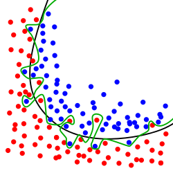

# Initial page

## Intro

범주를 따져보자면, 딥러닝이 머신러닝에 포함되고 머신러닝은 인공지능에 포함된다.

딥러닝을 간단하게 정의하면 **\*심층 신경망을 이용한 머신러닝 기법**이다.

머신러닝에는 지도적학습, 비지도적학습, 강화 학습이있고 딥러닝은 이 세가지종류의 모든 머신러닝에 사용된다. 

인공신경망이 개발된 초기에는 단층신경망만이 존재했고 단층신경망은 입력층과 출력층만이 있는 구조였다. 후에 은닉층이 포함된 구조인 다층신경망이 생겨났고 다층신경은 또다시 은닉층이 하나인 얕은신경망과 은닉층이 2개이상인 심층 신경망으로 나뉜다. 

머신러닝에서 다층신경망이 개발될 수 있었던 이유는 역전파 알고리즘과 관련이 있다.

출력값과 정답과의 오차를 수정해주는것이 단층신경망에서는 가능하지만 은닉층의 오차는 조절이 불가능했다. 은닉층의 출력값은 알수있어도 은닉층의 정답을 정의하지 못했기 때문이다.

이는 출력층에서 delta를 역방향으로 주어 출력층-&gt;은닉층으로 준 값을  통해 가중치를 조절하는 방법으로 해결할 수 있었고 그 알고리즘이 역전파 알고리즘이다.

역전파 알고리즘으로 다층신경망이 더 연구되면서 심층신경망또한 발전하게 되었지만 또 문제가 발생한다.

심층신경망과 같이 복잡한 모델은 과적합문제가 생기기 쉬웠고 이를 해결하는 여러 기법\(ex : drop out\)등을 통해 과적합문제를 해결하였고 하드웨어, 특히 GPU의 성능발전으로 딥러닝은 더욱 더 발전할수 있게된다.

마지막으로 빅데이터를 기반으로한 대량의 학습데이터를 사용함으로써 딥러닝은 현재 머신러닝의 한계를 극복하고 인공지능에서 가장 성능이 뛰어난 기술이 되었다.

머신러닝의 3대 연구분야로는 영상인식, 음성인식, 자연어 처리 등이 있다.

## 용어정리    

* 과적합 : 입력값을 지도학습으로 분류할 때 범주를 분류하기가 쉽지않은 별난 입력값까지 범주에 포함시켜 발생하는 문제이다. \(과적합되면 학습데이터에 대해서는 오차가 감소하지만 실제 데이터에 대해서는 오차가 커지게된다.\)

위 그림에서 초록색 선은 과적합된 모델, 검은색선은 일반모델을 나타낸다.

* 모델 : 학습데이터를 머신러닝 시킨 후 나온 결과물이다.
* regularization : 
* validation : 
* 활성함수 : 입력값으로부터 출력값까지의 출력값에 관여하는 함


활성함수의 종류 : sigmoid, tanh, ReLU, Maxout, ELU, Leaky ReLU


* 비용함수 : 오차와 비례한 델타를 통해 오차가 적은 가중치가 되게끔 가중치를 조절해주는 함수
* 심층신경망 : 은닉층이 2개이상인 다층신경망이다.
* 다층신경망 : 은닉층이 포함된 신경망이고 다층경망을 통해 비선형문제를 풀 수 있다.
* Convolution :  우리말로하면 합성곱이며 들어온 값에 어떠한 연산을 하여 값을 반환시키는 연산자이다. 딥러닝에서는 들어온 이미지에 합성곱 행렬을 연산하여 이미지의 특징을 추출하는 데 사용된다.

